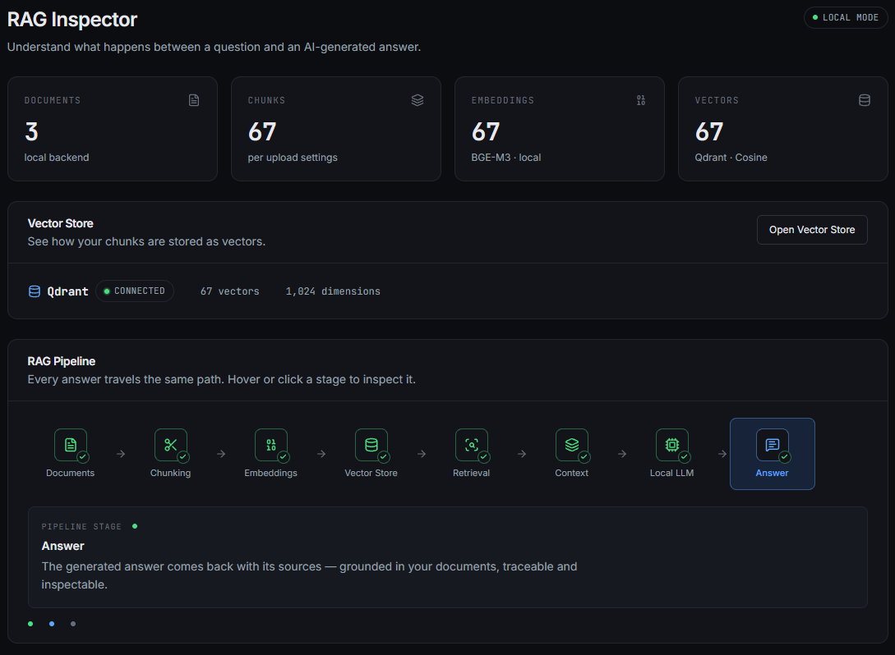
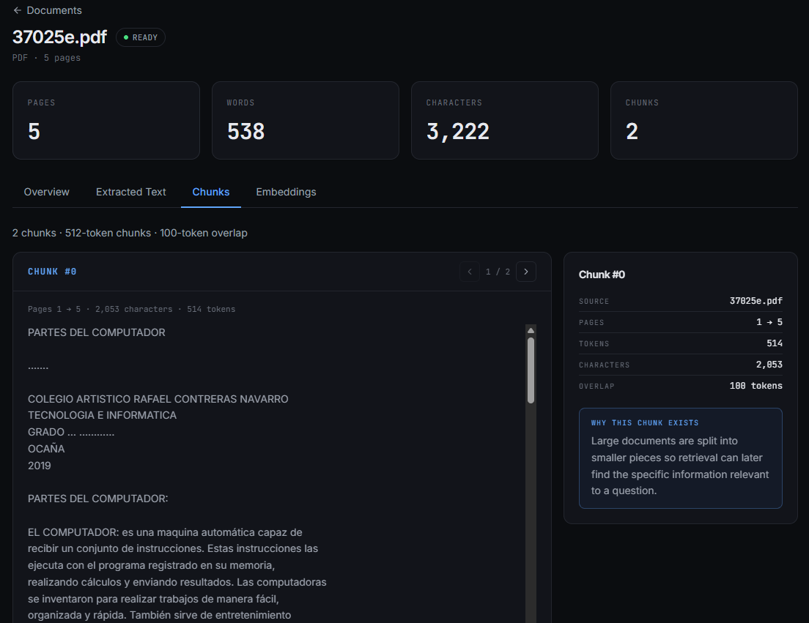
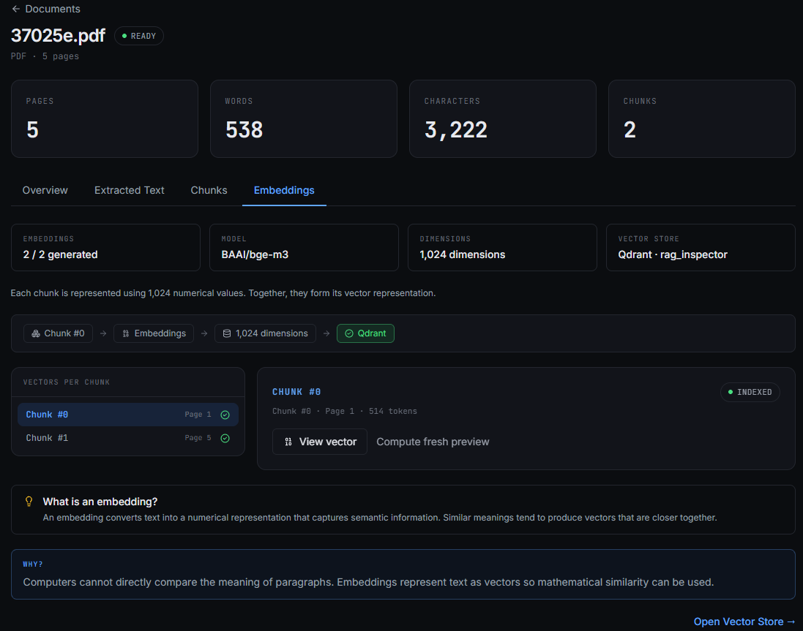
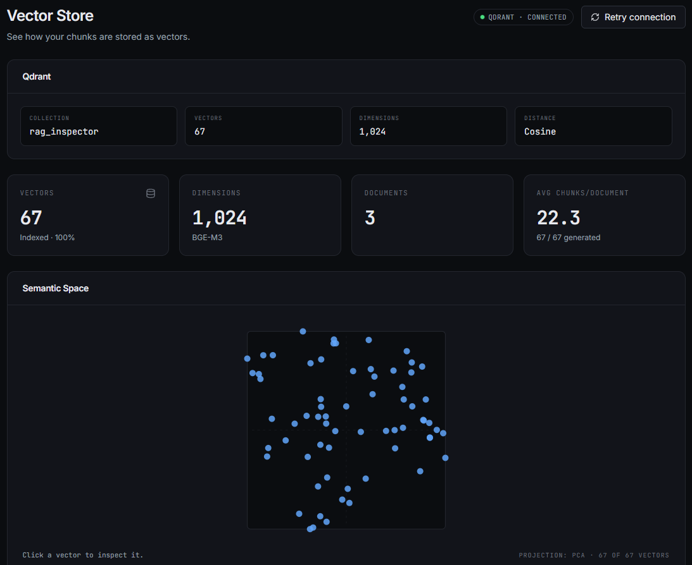
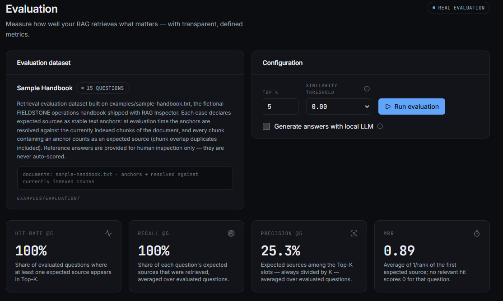

# RAG Inspector

> **RAG shouldn't be a black box.**

A visual playground for understanding how **Retrieval-Augmented Generation** works.

> Understand what happens between a question and an AI-generated answer.

---

## Overview

Most RAG demos show you two boxes: a question going in and an answer coming
out. The interesting part — the actual *retrieval* — is hidden.

**RAG Inspector** makes the whole pipeline visible. Every operation shows two
layers: **what happened** (the real numbers) and **why it matters** (the human
explanation).

As of **Phase 6**, the entire RAG pipeline runs locally and every step is
inspectable: ingest a document, embed it with BGE-M3, retrieve with Qdrant
cosine search, assemble a budgeted context, **see the exact prompt sent to
the model**, generate an answer with a local LLM through **Ollama**, follow
validated `[SOURCE_n]` citations back to the chunks they came from — and
**measure the whole thing** against a golden dataset with standard IR
metrics.

```text
Documents → Chunking → Embeddings → Vector Store → Retrieval → Context → Local LLM → Answer
  ● real      ● real      ● real        ● real        ● real      ● real     ● real      ● real

Golden dataset → run each question through the same pipeline → measured metrics
     ● real      (Hit Rate@K · Recall@K · Precision@K · MRR · citation coverage)
```

The core pipeline is complete. Future experiments may explore how
retrieval configurations affect the system.

No external AI APIs, no cloud services, no telemetry. By default, document
content, embeddings, vectors and prompts never leave this machine — the
processing path is Browser → local FastAPI → local BGE-M3 / Qdrant / Ollama.

## Current Pipeline (Phase 6 — complete)

```text
DOCUMENT → EXTRACT → CLEAN → CHUNK → EMBEDDINGS → QDRANT
                                                    ↓
USER QUESTION → QUERY EMBEDDING → COSINE TOP-K → RETRIEVED CHUNKS
                                                      ↓
                                    CONTEXT → PROMPT → OLLAMA → ANSWER → SOURCES

GOLDEN DATASET → anchors resolved against indexed chunks → per-question
                 pipeline run → Hit Rate@K / Recall@K / Precision@K / MRR
                 (+ citation metrics when generation is enabled)
```

## Local LLM generation

- **Ollama** (running as a native local process — not forced into Docker,
  so GPU setups work naturally) with a **configurable model**:
  `OLLAMA_MODEL=qwen3:8b` by default, any locally installed model works
  (`qwen3:4b` recommended on 16 GB RAM machines — see Local Development)
- The generation API owns the full orchestration: retrieval → context →
  prompt → Ollama. The frontend never stitches these steps together itself
- **Context budget**: whole chunks are packed in rank order up to
  `RAG_MAX_CONTEXT_TOKENS` (default 4,000 estimated tokens); what was
  included vs retrieved is always reported
- **Prompt Inspector**: the actual text sent to the model — system rules,
  labelled `[SOURCE_n]` context, user question — not an example
- **Run Inspector**: per-stage facts: retrieval results and time, included
  chunks, model, temperature, and only the timing/token metrics Ollama
  really reports
- **NDJSON streaming**: real stage events (`retrieving → building_context →
  building_prompt → generating`) plus answer tokens as they arrive, with
  cancellation. No simulated progress
- **Citation validation**: `[SOURCE_n]` markers produced by the model are
  checked against the context; unknown identifiers are shown as *unresolved
  citations*, never promoted to real sources
- **Honest wording**: an answer is "generated using the retrieved context
  shown below" — grounding is never *claimed* as a guarantee

## Evaluation

Phase 6 measures the pipeline instead of trusting it. A **golden dataset**
(`examples/evaluation/sample-handbook.json`, 15 questions over the shipped
sample handbook) declares each expected source as a **stable text anchor** —
an exact substring of the cleaned document. At run time anchors are resolved
against the *currently indexed* chunks, so the dataset survives re-chunking
with different settings.

- **Relevance ground truth comes only from anchors.** Similarity scores
  never decide relevance, and no LLM judges anything
- **Retrieval metrics** (exact definitions): Hit Rate@K = share of questions
  with ≥1 expected source in the top K · Recall@K = expected sources
  retrieved / expected sources · Precision@K = expected sources retrieved /
  K · MRR = average 1/rank of the first expected source
- **Generation metrics** (optional, real Ollama runs): citation coverage
  (answers with ≥1 verified citation), valid citation rate, and average
  timing/token stats — only what Ollama actually reports
- **Unresolvable anchors skip their case with a warning** — they are never
  silently scored as failures
- The UI shows a **question × rank matrix** (which rank position held a
  relevant chunk), **per-case detail** (expected vs retrieved, scores,
  answer + citations), an **experiment history** comparing runs across
  Top-K / threshold / model, and the full **methodology**
- Reference answers in the dataset are for human inspection only — never
  auto-scored

```jsonc
// POST /api/evaluation/run
{ "topK": 5, "scoreThreshold": 0, "generateAnswers": false }

// →
{
  "runId": "eval-9f3a1c2d4e5f",
  "retrievalMetrics": { "hitRateAtK": 1.0, "recallAtK": 0.8667,
                        "precisionAtK": 0.3733, "mrr": 0.9333 },
  "cases": [ { "questionId": "q01", "expectedSources": [...],
               "retrieved": [...], "metrics": {...} } ]
}
```

## Semantic Retrieval

Phase 4 makes retrieval real:

```text
USER QUESTION
    ↓
BGE-M3 query embedding (same model, same space as the chunks)
    ↓
Qdrant cosine top-K search
    ↓
Ranked chunks with similarity scores
```

- **Top-K** (1–20) and a **similarity threshold** (0–1) are user-controlled
- Retrieval can be **filtered to a single document**
- Every score is the **actual cosine similarity from Qdrant** — a retrieval
  similarity score, never a confidence score, never a probability
- The Retrieval page overlays the query star on the PCA semantic space and
  highlights exactly the top-K points that Qdrant returned
- No results is a legitimate outcome — the UI explains what to try instead,
  it never invents matches

**Retrieval is not generation.** Retrieval answers "which of my documents
are closest in meaning to this question?" — a mathematical comparison of
vectors. Generation answers "what sentence should the user read?" — a local
LLM writes it. RAG Inspector keeps the two visibly apart (they even live in
separate services) so you can debug one without guessing about the other.

```jsonc
// POST /api/retrieval/search
{ "query": "How does the approval process work?", "topK": 3 }

// →
{
  "query": "How does the approval process work?",
  "queryEmbedding": { "model": "BAAI/bge-m3", "dimensions": 1024 },
  "results": [
    { "rank": 1, "score": 0.7075, "documentName": "sample-handbook.txt",
      "chunkIndex": 0, "text": "FIELDSTONE — OPERATIONS HANDBOOK …" }
  ],
  "corpusSize": 3
}
```

## Embeddings

RAG Inspector uses a local embedding model to convert document chunks into
numerical vector representations.

- Model: **BAAI/bge-m3** (1,024 dimensions) via sentence-transformers
- Runs on CPU; CUDA is used automatically when available
- The model loads once per backend process and is reused for every request
- Embeddings and indexing run in the background after chunking, with visible
  progress states (`embedding → indexing → ready`) and retry on failure
- Point ids are deterministic: same document + same chunk settings → same
  vectors, no duplicates; changing chunk settings regenerates cleanly

## Vector Store

Vectors are stored locally in Qdrant using cosine distance.

- Collection `rag_inspector` is created automatically (1,024-dim, Cosine)
- Every vector carries its payload: document, chunk index, page range, text
  and token estimate — the payload retrieval and generation cite from
- Deleting a document deletes its vectors too; no orphans
- The **Vector Store** page shows connection state, statistics, an indexed
  chunk browser and per-vector inspection with a value heatmap

## Semantic Space

The application includes a 2D PCA visualization of the embedding space to
make semantic relationships easier to understand.

Each point is one chunk, projected server-side from 1,024 dimensions to 2.
The UI says so explicitly — this is a *projection* for exploring
relationships, not the actual vector space.

## Features

- **Documents** — real local ingestion: PDF/DOCX/TXT/MD upload with live
  pipeline states (upload → extract → clean → chunk → embed → index),
  per-document embeddings counts and retry on failure
- **Visual Chunking Explorer** — watch a document split into overlapping
  chunks; change chunk size and overlap and the visualization reacts
- **Embeddings tab** — generated/total, model metadata, chunk → vector →
  Qdrant flow, stored vectors fetched straight from the collection, and a
  compact heatmap of every dimension
- **Vector Store page** — Qdrant status, corpus statistics, indexed chunk
  browser, vector detail with heatmap, and the PCA semantic space
- **Retrieval Inspector** — now REAL: ask a question, watch the honest
  stage-by-stage run (embed query → search Qdrant), get ranked chunks with
  actual cosine scores, per-result “Why was this retrieved?” explanations,
  a query vector heatmap, and your query projected as a star in the
  semantic space with the top-K points highlighted
- **Playground** — the full RAG run, end to end and local: question → query
  embedding → Qdrant top-K → context → prompt → Ollama → streamed answer →
  validated source cards, with Prompt Inspector and Run Inspector
- **Evaluation** — golden dataset with anchored ground truth: Hit Rate@K,
  Recall@K, Precision@K and MRR from real Qdrant retrieval, optional
  citation metrics from real Ollama generation, question × rank matrix,
  per-case detail and experiment comparison history
- **Overview** — pipeline showing all eight stages as real, with live
  metrics when the local backend is running
- **Learn** — visual step-by-step explanation of how RAG works
- **English / Spanish** — full UI translation, persisted, no reload
- Light/dark themes, responsive layout, keyboard accessibility,
  reduced-motion support — zero external requests at runtime

## Screenshots

### Overview — the whole pipeline, live



### Chunking explorer — watch a document split



### Embeddings — every dimension of a real vector



### Semantic space — PCA projection of the corpus



### Evaluation — measured, not trusted



## Architecture

```text
React  →  /api (Vite proxy)  →  FastAPI
                                   ├─ document services (extract/clean/chunk)
                                   ├─ embedding service ── BGE-M3 (local)
                                   ├─ vector store service ── Qdrant (Docker)
                                   ├─ retrieval service (query embed + top-K,
                                   │   reusing the two above)
                                   ├─ context / prompt services
                                   └─ generation service ── Ollama (host)
                                                              ↓
                                                          local LLM
```

```text
├── src/                        frontend (React + TS + Vite + Tailwind v4)
│   ├── types/                  domain types
│   ├── i18n/                   en.ts / es.ts / provider (typed keys)
│   ├── services/               http · documentService · vectorStoreService
│   │                           · retrievalService · generationService
│   │                           · evaluationService
│   ├── data/                   remaining demo data (seed queries, docs)
│   ├── lib/  hooks/  theme/
│   ├── components/             layout · ui · pipeline · documents · chunking
│   │                           · embeddings · vectors · retrieval · generation
│   │                           · evaluation
│   └── pages/                  incl. /vector-store, /retrieval, /playground,
│                               /evaluation and /documents/:id
└── backend/                    FastAPI (see backend/README.md)
    └── app/
        ├── settings.py         model/collection/ports/budgets — defined once
        ├── api/                documents · embeddings · vectors · retrieval
        │                       · llm · generation · evaluation
        └── services/           extraction · cleaning · chunking · document
                                · embedding · vector_store (Qdrant lives here)
                                · retrieval · context · prompt
                                · ollama_service (Ollama lives here)
                                · generation · evaluation
```

Boundaries matter: `document_service` never imports Qdrant, `embedding_service`
owns the model, **only** `vector_store_service` talks to Qdrant, **only**
`ollama_service` talks to Ollama, `generation_service` is the one place
that orchestrates retrieval → context → prompt → LLM, and
`evaluation_service` **only measures** — it reuses retrieval and generation,
it never duplicates them.

## Roadmap

- [x] Initial UI
- [x] Dashboard
- [x] Document interface
- [x] Playground mock
- [x] Retrieval visualization
- [x] Local document ingestion
- [x] Text extraction
- [x] Document cleaning
- [x] Chunking engine
- [x] Visual chunking explorer
- [x] English / Spanish
- [x] Local embeddings
- [x] Qdrant integration
- [x] Vector visualization
- [x] Semantic space
- [x] Semantic retrieval
- [x] Top-K search
- [x] Query similarity
- [x] Ollama integration
- [x] Real RAG generation
- [x] Source citations
- [x] Evaluation — golden dataset, IR metrics, citation metrics

## Local Development

Requires Node.js 20+, Python 3.11+, Docker (for Qdrant) and Ollama (for
generation).

> **RAM is the hard constraint.** The embedding model (BGE-M3, ~2.5 GB)
> and the LLM are resident at the same time.
>
> **Recommended for 16 GB RAM: `qwen3:4b`.**
> Larger models require additional memory depending on the embedding
> model and runtime. The shipped default is `qwen3:8b` — use it only with
> comfortable headroom beyond 16 GB.

### First-time Ollama setup

1. Install Ollama natively for your OS (https://ollama.com/download).
   It runs as a local process with direct GPU access when a GPU exists —
   that's why it is **not** forced into Docker here.
2. Start the server: `ollama serve` (the desktop app does this for you).
3. Pull the model you intend to use, explicitly — RAG Inspector never
   downloads models for you. On a 16 GB machine, start with:
   ```bash
   ollama pull qwen3:4b
   ```
   and point the backend at it with `OLLAMA_MODEL=qwen3:4b` (the shipped
   default, `qwen3:8b`, only pays off with more headroom).

Generation speed depends entirely on your hardware: on CPU expect seconds
per answer with a 4B model and minutes with an 8B one. On CPU, Ollama's
"thinking" mode is disabled by default (`RAG_LLM_THINKING=1` enables it) to
keep first runs usable.

### Run everything

```bash
# 1. Vector store
docker compose up -d

# 2. Backend
cd backend
python -m venv .venv && .venv/Scripts/activate   # Windows
# source .venv/bin/activate                      # macOS / Linux
pip install -r requirements.txt                  # torch resolves to the CPU build
uvicorn app.main:app --reload --port 8000

# 3. Frontend (new terminal, repo root)
npm install
npm run dev
```

### Optional configuration (env, all defaulted in `backend/app/settings.py`)

| Variable | Default |
|---|---|
| `OLLAMA_BASE_URL` | `http://127.0.0.1:11434` |
| `OLLAMA_MODEL` | `qwen3:8b` (`qwen3:4b` on 16 GB RAM) |
| `OLLAMA_TIMEOUT_SECONDS` | `600` |
| `RAG_LLM_THINKING` | off |
| `RAG_MAX_CONTEXT_TOKENS` | `4000` |
| `RAG_DEFAULT_TEMPERATURE` | `0.2` |
| `RAG_SYSTEM_PROMPT` | built-in (anti-hallucination + citation rules) |
| `RAG_INSPECTOR_EVAL_DIR` | `examples/evaluation` (golden-dataset JSONs) |

First document ingestion after startup loads BGE-M3 once (the model weights
are downloaded to the Hugging Face cache the first time, then reused).

Try it immediately with the fictional sample: `examples/sample-handbook.txt`.

With the backend offline, Documents shows demo data and says so. With Qdrant
offline, ingestion still works and indexing is marked failed — with retry.
With Ollama offline, generation fails loudly with a clear explanation —
never a mocked answer.

## Tech Stack

- React 19 + TypeScript (strict)
- Vite · Tailwind CSS v4 · React Router v7 · Lucide icons
- FastAPI + PyMuPDF + python-docx
- sentence-transformers (BAAI/bge-m3, local CPU/CUDA) + Qdrant (Docker)
- Ollama (native local process) for generation, streamed as NDJSON
- Server-side PCA with NumPy · hand-rolled SVG scatter (no chart library)
- pytest (unit tests run hermetically: fake embedder + in-process Qdrant +
  fake Ollama)

No UI kit, no animation library, no state manager, no chart dependency.
Intentionally.

## Why RAG Inspector?

Because "Question → AI → Answer" teaches people nothing. RAG is a pipeline of
concrete, inspectable steps — documents, chunks, vectors, similarity scores,
context assembly, generation. When you can *see* each step, the magic becomes
engineering.

RAG Inspector is built to be both:

- a real local-first dev tool, and
- the clearest way to **learn** how retrieval actually works.

Everything runs on your machine. Nothing phones home.

## License

[MIT](./LICENSE)
